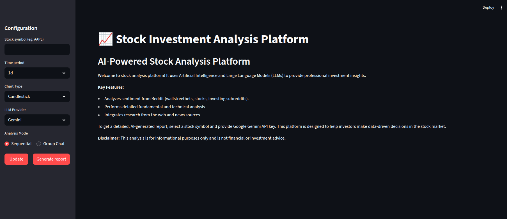
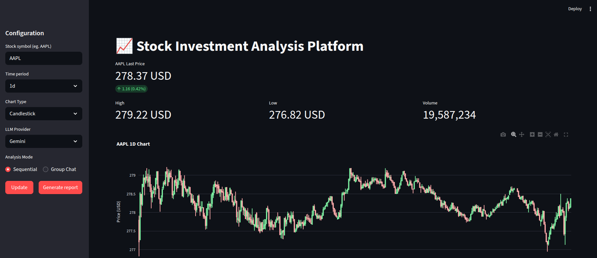
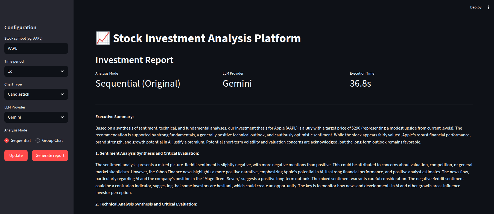

# Stock Investment Analysis Platform (nlp-2025l)

[](https://www.python.org/downloads/)
[](https://streamlit.io)
[](https://www.crewai.com/)
[](https://opensource.org/licenses/MIT) 

## Overview

The Stock Investment Analysis Platform is an AI-powered application designed to provide comprehensive investment insights and generate detailed analysis reports for publicly traded stocks. It leverages a team of AI agents, each specializing in a different aspect of stock analysis, to gather, process, and synthesize information from various sources. The platform aims to help investors make more informed, data-driven decisions.

The final output is a cohesive investment report in Markdown format, offering an executive summary, synthesized analyses (sentiment, technical, fundamental), discussion of convergences/divergences, catalysts, risk factors, and an investment outlook with recommendations.

## Features

* **Multi-Agent Analysis with Multiple Modes:** Utilizes a team of AI agents (powered by CrewAI) for specialized tasks:
    * **Sequential Mode:** Linear workflow with 4 agents
        * **Senior Stock Market Researcher:** Gathers qualitative data, public sentiment from Reddit, Yahoo News, and Yahoo financial analyses.
        * **Expert Technical Analyst:** Performs in-depth technical analysis using a wide array of indicators.
        * **Senior Fundamental Analyst:** Conducts comprehensive fundamental analysis of the company's financial health, valuation, and market position using Yahoo Finance data.
        * **Chief Investment Strategist:** Synthesizes all analyses into a final investment report.
    * **Group Chat Mode (FinDebate):** Hierarchical debate with 6 agents
        * Original 3 specialist agents (Researcher, Technical Analyst, Fundamental Analyst)
        * **Devil's Advocate (Sceptic):** Challenges assumptions and identifies risks
        * **Data Verification Specialist:** Validates data accuracy and source credibility
        * **Discussion Moderator & Chief Synthesizer (Leader):** Orchestrates the debate and synthesizes final recommendation
* **Dual LLM Provider Support:** 
    * **Gemini** (Google) - Default provider with fast lite models
    * **OpenAI** - Alternative provider with GPT-4 models
    * Easy provider switching via UI dropdown or `.env` configuration
* **Interactive Web Interface:** Built with Streamlit for easy user interaction, allowing users to input stock symbols and view charts and reports.
* **Data Sources:**
    * **Yahoo Finance (yfinance):** For historical stock data, company information, financial news, analyst estimates, and fundamental data.
    * **Reddit:** For public sentiment analysis on specified subreddits (e.g., r/wallstreetbets, r/stocks, r/investing).
* **Comprehensive Analysis:**
    * **Sentiment Analysis:** Processes Reddit discussions, Yahoo News, and analyst opinions to gauge public sentiment towards the stock.
    * **Technical Analysis:** Calculates and interprets indicators like SMAs, EMAs, MACD, RSI, Bollinger Bands, Stochastics, ATR, OBV, and more. Identifies trends, patterns, support/resistance levels.
    * **Fundamental Analysis:** Assesses financial health, profitability, growth prospects, valuation (P/E, P/S, D/E, ROE, etc.), and overall intrinsic value.
* **Dynamic Charting:** Displays stock price charts (candlestick or line) with configurable time periods using Plotly.
* **PDF Export:** Download complete investment reports with charts and metrics in professional PDF format.

## How it Works (Architecture)

The platform operates using a multi-agent system orchestrated by CrewAI with two distinct execution modes:

### Sequential Mode (Original - Default)
1. The user inputs a stock symbol via the Streamlit interface.
2. A `SequentialStockAnalysisCrew` is initialized with 4 agents (Researcher, Technical Analyst, Fundamental Analyst, Reporter).
3. Agents execute in linear order with task dependencies:
   - **Researcher** gathers news from Yahoo Finance, analyst opinions, and sentiment from Reddit
   - **Technical Analyst** fetches historical market data and performs technical analysis
   - **Fundamental Analyst** fetches and analyzes company financial data
   - **Reporter** synthesizes all outputs into a comprehensive investment report
4. Final report is displayed in the Streamlit application.

### Group Chat Mode (FinDebate - New)
1. User selects "Group Chat" mode in the UI.
2. A `GroupChatStockAnalysisCrew` is initialized with 6 agents in a hierarchical structure.
3. Agents execute in parallel with group discussion coordination:
   - **Original 3 specialists** (Researcher, Technical Analyst, Fundamental Analyst) gather and analyze data
   - **Sceptic** challenges assumptions and identifies potential risks
   - **Trust Agent** validates data accuracy and source credibility
   - **Leader** orchestrates the debate and synthesizes final consensus recommendation
4. Hierarchical process ensures all perspectives are considered before final recommendation.
5. Final debate-synthesized report is displayed.

### LLM Provider Configuration
- **Gemini (Default):** Uses `gemini-2.0-flash-lite` (sequential) and `gemini-2.0-flash` (group chat)
- **OpenAI:** Uses `gpt-4o-mini` (sequential) and `gpt-4o` (group chat)
- Provider can be changed via UI dropdown or configured in `.env` file

## Technologies Used

* **Backend & AI:**
    * Python (`>=3.10`)
    * CrewAI (`>=1.6.1`) - Multi-agent orchestration framework
    * Google Gemini API (via CrewAI LLM integration)
    * OpenAI API (gpt-4o family models)
    * Transformers (`>=4.51.3`) (for local sentiment analysis model)
    * PyTorch (`>=2.7.0`)
* **Data Handling & Analysis:**
    * Pandas
    * NumPy
    * yfinance (`>=0.2.61`) (for Yahoo Finance data)
    * PRAW (`>=7.8.1`) (for Reddit data)
    * TA-Lib (`>=0.6.3`) (for technical indicators)
* **Web Interface & Visualization:**
    * Streamlit (`>=1.45.1`)
    * Plotly (`>=6.1.0`)
    * ReportLab (`>=4.0.0`) (for PDF generation)
* **Configuration & Environment:**
    * python-dotenv (`>=1.0.0`) (for environment variable management)


## Setup and Installation

1.  **Clone the repository:**
    ```bash
    git clone <your-repository-url>
    cd nlp-2025l
    ```

2.  **Create a virtual environment (recommended):**
    ```bash
    make create_environment
    source .venv/bin/activate
    ```

3.  **Install dependencies:**
    ```bash
    make requirements
    ```
    *Note on TA-Lib:* TA-Lib can sometimes be tricky to install. Please refer to the official TA-Lib installation guide for your operating system if you encounter issues.

4.  **Set up Environment Variables:**
    Create a `.env` file in the root directory of the project (`nlp-2025l/`):
    ```
    REDDIT_CLIENT_ID="YOUR_REDDIT_CLIENT_ID"
    REDDIT_CLIENT_SECRET="YOUR_REDDIT_CLIENT_SECRET"
    REDDIT_USER_AGENT="YOUR_REDDIT_USER_AGENT_STRING"
    LLM_PROVIDER="gemini"
    GEMINI_API_KEY="YOUR_GEMINI_API_KEY"
    OPENAI_API_KEY="YOUR_OPENAI_API_KEY"
    ```
    Replace the placeholder values with your actual API keys.
    * **Reddit API Credentials:** Create an app on Reddit to get these https://www.reddit.com/prefs/apps. `REDDIT_CLIENT_ID` will be in the left top corner, `REDDIT_CLIENT_SECRET` will be next **secret** field, and `REDDIT_USER_AGENT` can be any string that describes your application.
    * **LLM Provider:** Select `gemini` or `openai`. In the application you can change the provider from the dropdown menu.
      - **Gemini:** Pobierz klucz z https://aistudio.google.com/app/apikey
      - **OpenAI:** Pobierz klucz z https://platform.openai.com/api-keys

## Running the Application

Once the setup is complete, run the Streamlit application:
```bash
uv run streamlit run src/app.py
```

### Using the Application

1. **Configure Stock Analysis:**
   - Enter a stock symbol (e.g., `AAPL`, `NVDA`)
   - Select time period for chart data (1d, 5d, 1mo, 6mo, ytd, 1y, 5y, max)
   - Choose chart type (Candlestick or Line)
   - **Select Technical Indicators** (expandable section):
     - **Moving Averages:** SMA 20/50/200, EMA 20/50
     - **Volatility:** Bollinger Bands
   - Click "Update" to fetch data and display chart with selected indicators

2. **Select Analysis Mode:**
   - **Sequential Mode** (default): Linear execution with 4 specialists - faster and more deterministic
   - **Group Chat Mode**: Hierarchical debate with 6 agents - longer execution but more thorough analysis with risk assessment

3. **Choose LLM Provider:**
   - **Gemini** (default): Fast API, good quality for financial analysis
   - **OpenAI**: Alternative provider, switch anytime from dropdown

4. **Generate Analysis:**
   - Click "Update" to fetch and display stock chart with current metrics
   - Click "Generate report" to run multi-agent analysis
   - View comprehensive investment report with mode and provider information
   - **Export Report:** Click "Download Report as PDF" to export the full analysis with chart and metrics

## Analysis Modes Comparison

| Feature | Sequential Mode | Group Chat Mode |
|---------|-----------------|-----------------|
| **Agents** | 4 specialists | 6 agents (specialists + debate) |
| **Execution** | Linear with dependencies | Hierarchical with parallel tasks |
| **Execution Time** | Faster (typically 1-3 min) | Slower (typically 3-8 min) |
| **Analysis Type** | Direct synthesis | Debate with risk assessment |
| **Risk Focus** | Integrated | Dedicated Sceptic agent |
| **Data Validation** | Implicit | Explicit verification by Trust Agent |
| **Recommendation** | Direct from Reporter | Consensus after group debate |
| **Best For** | Quick decisions, lower cost | Thorough analysis, risk-averse investors |

## Configuration Guide

### Environment Variables (`.env` file)

```dotenv
# Reddit API (optional, needed for sentiment analysis)
REDDIT_CLIENT_ID=your_reddit_client_id
REDDIT_CLIENT_SECRET=your_reddit_client_secret
REDDIT_USER_AGENT=your_user_agent_string

# LLM Configuration (required)
LLM_PROVIDER=gemini                    # Choose: "gemini" or "openai"
GEMINI_API_KEY=your_gemini_api_key    # Get from: https://aistudio.google.com/app/apikey
OPENAI_API_KEY=your_openai_api_key    # Get from: https://platform.openai.com/api-keys
```

### Changing Default Provider

To change the default LLM provider:
1. Edit `.env` file and change `LLM_PROVIDER` value
2. Or select different provider from UI dropdown (this overrides `.env` setting temporarily)

## Technical Indicators Guide

The platform supports the following technical indicators for chart analysis:

### Moving Averages
- **SMA (Simple Moving Average):** 20, 50, 200 periods - identifies trends
- **EMA (Exponential Moving Average):** 20, 50 periods - more responsive to recent prices

### Volatility Indicators
- **Bollinger Bands:** Shows price range and volatility
  - Upper/Lower bands indicate extremes
  - Squeeze indicates low volatility

All indicators can be toggled on/off in the "Technical Indicators" section of the sidebar when updating charts.

## Screenshots
### Main Interface


### Stock Chart


### Generated Report Section in App


## Example Report Output

The platform generates a detailed Markdown report. Here's a snippet from an example report for NVDA ([see full example](results/NVDA.md)):

```markdown
**NVDA Investment Report**

**Executive Summary:**

We recommend a **Hold** rating on NVDA with a price target range of $150-$160 over the next 6-12 months. This recommendation is based on NVDA's strong fundamentals, dominant position in the AI market, and robust growth prospects, tempered by its high valuation and potential short-term technical headwinds. While the long-term outlook remains positive, the current price reflects much of the anticipated growth, and potential risks warrant a cautious approach.

**Sentiment Analysis Synthesis:**

The sentiment surrounding NVDA is cautiously optimistic. Positive sentiment is fueled by significant deals like Oracle's planned purchase of Nvidia chips and Elon Musk's commitment to expanding GPU infrastructure. These developments underscore the strong demand for Nvidia's technology in the AI sector. However, concerns about slowing cloud spending and potential trade headwinds create a mixed sentiment.
...
```

You can find more example reports (like `AAPL.md`) and raw data outputs (like `AAPL_news.json`) in the `/results` directory.


## Disclaimer
This analysis is for informational purposes only and is not financial or investment advice. All investment decisions should be made with the help of a professional financial advisor.

## Future Enhancements
* Implement additional data sources for sentiment analysis (e.g., Twitter/X).
* Implement user accounts and history of generated reports.
* Support for cryptocurrency and commodity analysis.
* Custom agent configurations and roles.
* Batch analysis for multiple stocks.
* Real-time price alerts and notifications.
* Support for additional LLM providers (Claude, Llama, etc.).
* Comparison mode for analyzing multiple stocks side-by-side.
* Advanced technical analysis with custom indicator parameters.
* Save and load custom indicator presets.