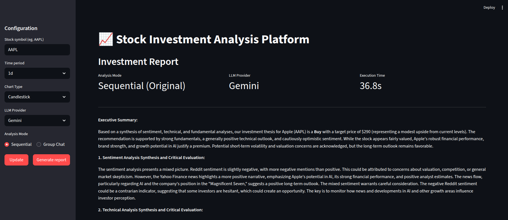
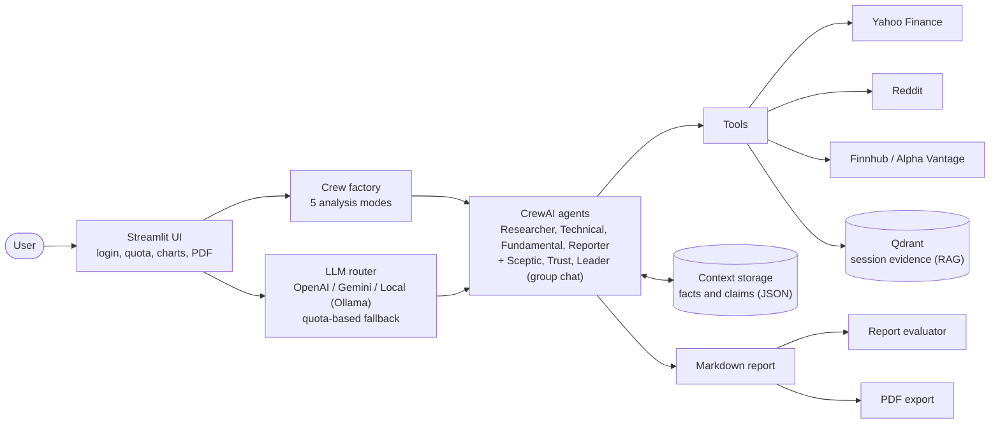
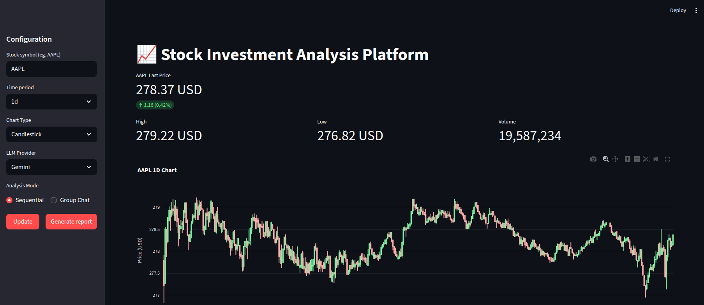

# Multi-Agent Stock Analysis Platform

A Streamlit application in which teams of LLM agents (CrewAI) research a listed company from several data sources and write a structured investment report, with five agent-collaboration modes, RAG over collected evidence (Qdrant), OpenAI / Gemini / local (Ollama) models, and built-in report evaluation.

> University project for *Natural Language Processing* (NLP), Warsaw University of Technology, 2026. Authors: Marcin Bagnowski, Maciej Matuszewski. Project report (Polish): [docs/report_pl.pdf](docs/report_pl.pdf).
>
> **Disclaimer:** the output is generated by language models for demonstration purposes only. It is not financial or investment advice.



*Report view of an early version of the UI (two analysis modes at the time; the current UI has five, see below).*

---

## Table of Contents

- [Overview](#overview)
- [Key Features](#key-features)
- [Architecture](#architecture)
- [Analysis Modes](#analysis-modes)
- [Evaluation](#evaluation)
- [Tech Stack](#tech-stack)
- [Project Structure](#project-structure)
- [Getting Started](#getting-started)
- [Configuration](#configuration)
- [Local Model Deployment](#local-model-deployment)
- [Limitations](#limitations)

---

## Overview

Given a ticker symbol (e.g. `AAPL`), the platform lets specialised agents gather news, analyst opinions, social sentiment, fundamentals and technical indicators, and synthesises everything into a Markdown report with an executive summary, sentiment / technical / fundamental sections, catalysts, risks and an outlook. The report can be exported to PDF together with the price chart and key metrics.

The project compares different ways of organising the same agents (linear, parallel, multi-round with a shared blackboard, debate with a sceptic and a trust-checker), and measures the effect on report quality and runtime.

## Key Features

- **Five analysis modes** – Sequential, Parallel, Concurrent (multi-round), Group Chat (original) and Group Chat (Context Storage + RAG), selectable in the UI
- **Multiple LLM providers** – OpenAI, Google Gemini, and a local model served by Ollama through LiteLLM; when a user's daily quota for metered providers is exhausted the app falls back to the local model
- **Evidence store and shared context** – tools write fetched data to a per-session Qdrant collection (RAG) and agents exchange facts and claims (with `refutes_id` for corrections) through a JSON "blackboard"; both can be inspected in the UI
- **Data sources** – Yahoo Finance (`yfinance`: prices, news, analyst estimates, fundamentals), Reddit via PRAW, Finnhub and Alpha Vantage sentiment endpoints; technical indicators computed with TA-Lib
- **Interactive charts** – Plotly candlestick or line charts with SMA 20/50/200, EMA 20/50 and Bollinger Bands
- **Report evaluation** – heuristic scoring of structure, data richness, professional language, actionability and sentiment balance (0–100, letter grade)
- **PDF export** with chart and metrics
- **Authentication and quotas** – `streamlit-authenticator` login with bcrypt-hashed credentials, per-user daily query limit, admin tool to reset a user's limit
- **Containerised** – Docker Compose for the app and Qdrant

## Architecture


```mermaid
flowchart LR
  user([User]) --> ui["Streamlit UI<br/>login, quota, charts, PDF"]
  ui --> router["LLM router<br/>OpenAI / Gemini / Local (Ollama)<br/>quota-based fallback"]
  ui --> factory["Crew factory<br/>5 analysis modes"]
  factory --> agents["CrewAI agents<br/>Researcher, Technical, Fundamental, Reporter<br/>+ Sceptic, Trust, Leader (group chat)"]
  router --> agents
  agents --> tools["Tools"]
  tools --> yf["Yahoo Finance"]
  tools --> rd["Reddit"]
  tools --> fh["Finnhub / Alpha Vantage"]
  tools --> qd[("Qdrant<br/>session evidence (RAG)")]
  agents <--> bb[("Context storage<br/>facts and claims (JSON)")]
  agents --> report["Markdown report"]
  report --> ev["Report evaluator"]
  report --> pdf["PDF export"]
```

## Analysis Modes

| Mode | Agents | How they collaborate |
|---|---|---|
| **Sequential** | Researcher, Technical Analyst, Fundamental Analyst, Reporter | Linear pipeline; each task depends on the previous ones |
| **Parallel** | same four | The three specialists run asynchronously; the Reporter synthesises at the end (uses the provider's base model) |
| **Concurrent (multi-round)** | same four | Round 1: specialists gather data in parallel and post facts and evidence. Round 2: each reads the others' facts and adds cross-checking claims. Round 3: the Reporter synthesises the report from the blackboard and Qdrant |
| **Group Chat (original)** | specialists + Sceptic, Trust agent, Leader | Hierarchical debate coordinated by a Leader |
| **Group Chat (CS + RAG)** | 6 agents | Debate with a multi-stage flow, the shared context storage and evidence retrieval from Qdrant |

## Evaluation

`tmp/generate_latex_eval_table.py` runs a mode repeatedly and scores each report with the built-in evaluator. The table gives means of 5 runs per ticker for AAPL, NVDA and GOOGL; the raw LaTeX tables are in `tmp/`. The provider and model used for these runs are not recorded in the repository.

| Mode | Overall score (0–100) | Mean runtime (s) |
|---|---|---|
| Sequential | 79.8 | 99 |
| Parallel | 82.5 | 51 |
| Concurrent (multi-round) | 88.9 | 138 |
| Group Chat (CS + RAG) | 89.4 | 373 |

A second run set for AMD and MSFT (`tmp/res_ag_*.tex`, which also includes the original Group Chat mode) gives 74–80 for Sequential and Parallel and 87–90 for Concurrent and both Group Chat variants, at 128–283 s for those three modes.

The score is a heuristic over the text of the report (section completeness, amount of data, language, presence of targets and recommendations, sentiment balance), so it measures the *form* of a report, not the correctness of the investment thesis. The multi-round and debate modes score higher, at roughly 2.7× (Concurrent) to 7× (Group Chat CS + RAG) the runtime of Parallel mode on the AAPL / NVDA / GOOGL set.



## Tech Stack

| Area | Tools |
|---|---|
| Agents and LLMs | CrewAI, LiteLLM, OpenAI, Google Gemini, Ollama (Qwen 2.5 32B by default for the local provider) |
| Retrieval | Qdrant, embeddings from OpenAI / Gemini / Ollama (`nomic-embed-text`) |
| Data | yfinance, PRAW, Finnhub, Alpha Vantage, TA-Lib, pandas |
| UI and reports | Streamlit, Plotly, ReportLab, streamlit-authenticator |
| Tooling | uv, Docker Compose, ruff, mypy |

## Project Structure

```
src/
  app.py              Streamlit application
  config.py           provider and Qdrant configuration
  llm_router.py       provider selection and quota fallback
  auth/               login and per-user quota
  crews/              agents, tasks and the five crew implementations
  tools/              CrewAI tools (data fetching, context storage, Qdrant)
  services/           API clients, sentiment analysis, Qdrant and context storage
  utils/              charts, PDF export, report evaluator
docs/                 local model setup guide, project report (PL), sample results
screenshots/          UI screenshots
tmp/                  evaluation script and LaTeX result tables
Dockerfile, docker-compose.yml, Makefile, pyproject.toml
```

## Getting Started

Requires Docker, or Python ≥ 3.10 with [`uv`](https://docs.astral.sh/uv/) and the TA-Lib C library (see the TA-Lib installation guide for your OS).

1. Create the configuration files:

   ```bash
   cp .env.example .env                                             # add API keys, choose the provider
   cp src/auth/credentials.example.yaml src/auth/credentials.yaml   # replace demo users, hashes and cookie key
   ```

2. Run with Docker Compose (app on port 8501, Qdrant on 6333/6334):

   ```bash
   docker compose up -d --build
   ```

   or run locally next to a Qdrant container:

   ```bash
   docker run -p 6333:6333 -p 6334:6334 -v ./qdrant_storage:/qdrant/storage qdrant/qdrant
   make requirements    # uv sync
   make run             # streamlit run src/app.py
   ```

3. Open <http://localhost:8501>, log in, enter a ticker, pick the provider and analysis mode, press **Update** to draw the chart and **Generate report** to run the agents.

Development commands: `make lint` (ruff), `make format`.

## Configuration

Main variables in `.env` (see `.env.example`):

| Variable | Purpose |
|---|---|
| `LLM_PROVIDER` | default provider: `openai`, `gemini` or `local` |
| `OPENAI_API_KEY`, `GEMINI_API_KEY` | model access |
| `REDDIT_CLIENT_ID`, `REDDIT_CLIENT_SECRET`, `REDDIT_USER_AGENT` | Reddit sentiment (PRAW) |
| `FINNHUB_API_KEY`, `ALPHA_VANTAGE_API_KEY` | additional sentiment sources |
| `QDRANT_HOST`, `QDRANT_PORT`, `QDRANT_GRPC_PORT` | vector database |
| `LOCAL_LLM_BASE_URL`, `LOCAL_LLM_MODEL` | Ollama endpoint (root URL, no `/v1`) and model |
| `DAILY_QUERY_LIMIT` | daily queries per user for OpenAI / Gemini |

## Local Model Deployment

[docs/local_model_setup.md](docs/local_model_setup.md) describes a two-machine deployment: a GPU server running Ollama (Qwen 2.5 32B, quantised) and a web VM running the app behind nginx with Docker Compose. Host names and addresses in the guide are placeholders.

## Limitations

- Reports are LLM output; there is no ground-truth evaluation of the investment recommendations, and the evaluator scores form only.
- Free API tiers rate-limit heavily (the UI shows details for HTTP 429 errors); the multi-agent modes make many LLM calls.
- The screenshots in `screenshots/` come from earlier versions of the UI.
- The repository has no automated tests.
